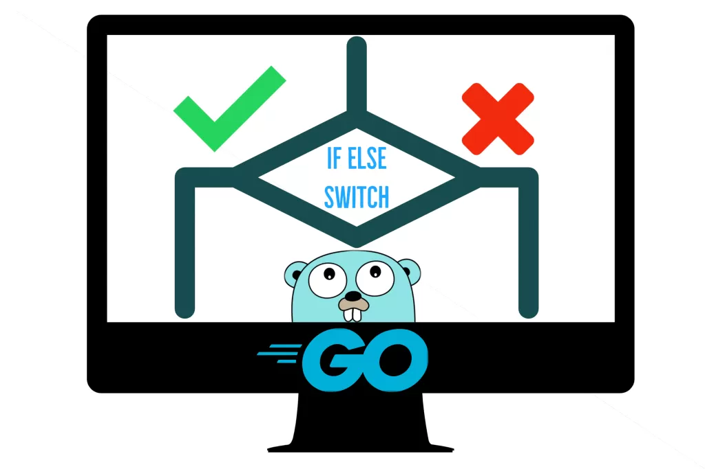

Control flow is important in Go. Control flow works a little different in GO, since it only has the for loop, conditionals like if and else(true and false), and switch. Structs are what GO provides in lieu of classes.


## If

The if statement is the most basic way to control the flow of a program.

```go
func sqrt(x float64) string {
    if x < 0 {
        return sqrt(-x) + "i"
    }
    return fmt.Sprint(math.Sqrt(x))
}
```

Take this function for example, we return the the sqrt of x as long as it is greater than 0. if the number is a negative integer, we return the irrational square root of the number.

## For

There is only one looping construct in Go....I know. Hold the phone though, does this mean that Go is less powerful? Not at all, in fact I feel this makes things simpler and you can use a for loop in so many situations.

For example this is the solution to the second project euler problem in Golang:

```go
    func evenacci(num int) int {
        cur := 1;
        next := 2;
        total := 0;
        for cur <= num {
            if cur % 2 == 0 {
                total += cur
            }
            var d = cur + next;
            cur = next;
            next = d;
        }
        fmt.Println(total)
        return total
    }
```

This is a way to write a for loop by setting the variables before you declare the loop. As a note to anyone new with go the **:** symbol is shorthand to declare a variable.

Here's another:

```go
    sum := 0
    for i := 0; i < 10; i++ {
        sum += i
    }
    fmt.Println(sum)
```

If you have used other languages, then this will look pretty familiar. We're setting a variable named i in the loop. This example is from golang.org, you can find it here: https://tour.golang.org/flowcontrol/1

here is one more example using range:

```go
    nums := []int{2, 3, 4}
        sum := 0
        for _, num := range nums {
            sum += num
        }
        fmt.Println("sum:", sum)
```

Those are three different examples of using a for loop in a different way to accomplish a task.

## Switch

The last way to control flow in GO is the switch statement. You can use the switch instead of multiple if else statements. 

```go
switch os := runtime.GOOS; os {
	case "darwin":
		fmt.Println("OS X.")
	case "linux":
		fmt.Println("Linux.")
	default:
		// freebsd, openbsd,
		// plan9, windows...
		fmt.Printf("%s.\n", os)
```

These are all the examples of how to use control flow within the programming language go.